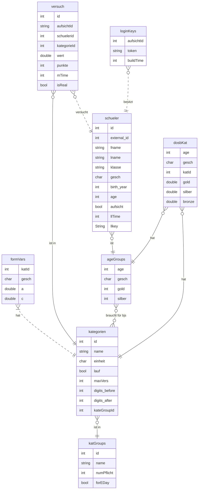
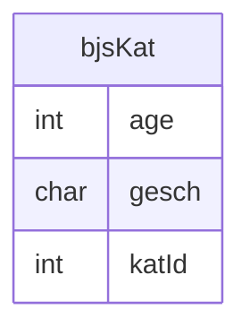

# Dokumentation
Hier werde ich versuche eine Dokumentation über die Bibeliothek zu führen. Das hat den Grund, dass jedesmal wenn ich mir den Code angucke ich nicht mehr versteh, was er tut. Das ist kacke.

Also hier ein paar Dokumente zur Unterstützung.
# Datenbank
Hier ist ein Diagramm mit der Datenbank struktur

Die n:m Verbindung "braucht für bjs" wurde mit folgender Relation umgesetzt:

# Main
Die Hauptmodell ist das interact Module. In dem sind einige Funktionen mit denen man mit der Datenbank kommunizieren kann.
Diese werden für den Upload von Schuelern, Daten von Schuelern abrufen und Informationen zu Kategorien. Hier eine volle List der funktionen:

+ upload_schueler

+ get\_schueler
+ get_dosb_task_for_schueler
+ get_bjs_task_for_schueler
+ get_all_versuch_for_kat
+ get_top_versuch_by_kat
+ get_top_versuch_in_bjs
+ get_top_versuch_in_dosb
+ get_bjs_kat_groups
+ need_kat
+ add_versuch
+ get_versuch_by_id
+ set_is_real
+ get_all_kat
+ get_kategorie
+ calc_points
Diese brauchen fast immer eine Referenz zu einem SQLitePool.

# Manage
Hier sind funktionen die genutzt werden können um die Datenbank selber zu modifizieren. Dabei werden die folgenden Funktionen benu

