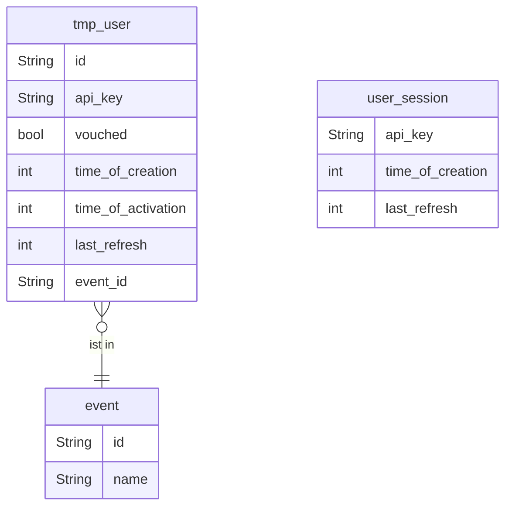
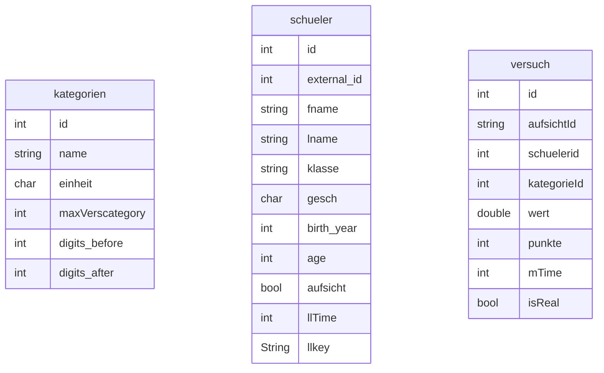
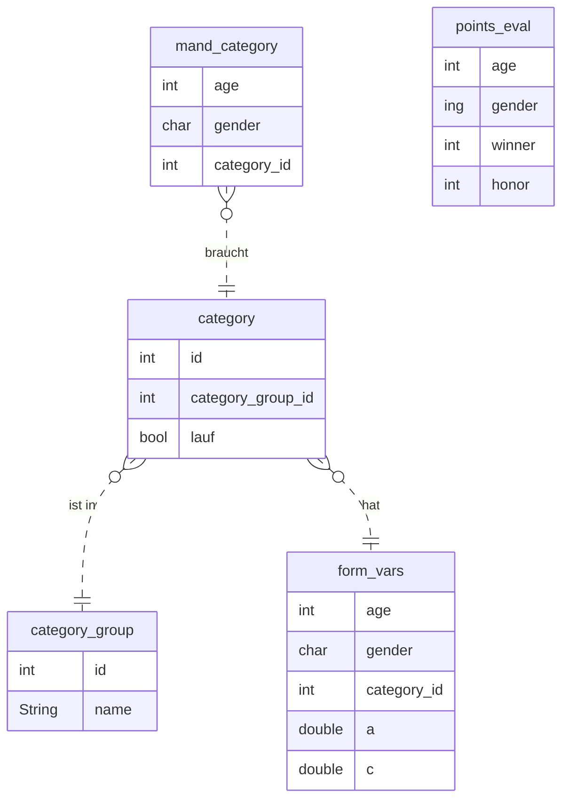
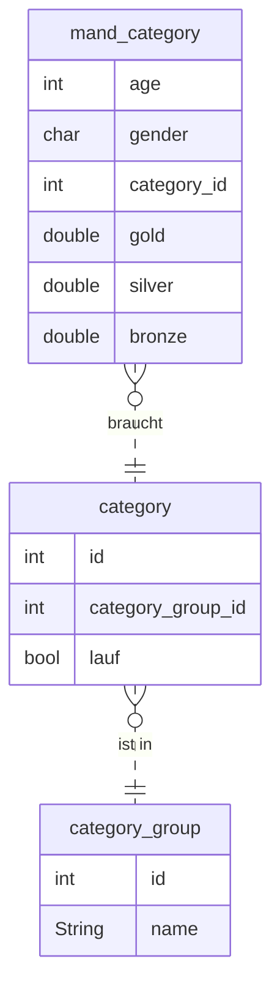

# Dokumentation
Hier werde ich versuche eine Dokumentation über die Bibeliothek zu führen. Das hat den Grund, dass jedesmal wenn ich mir den Code angucke ich nicht mehr versteh, was er tut. Das ist kacke.

Also hier ein paar Dokumente zur Unterstützung.
# Datenbank
Es gibt insgesamt =< 4 Datenbanken. Die erste ist die Auth databank. Diese ist zum managen der User und verteilen sowie auth der tmp_user gedacht. Die Struktur ist folgendermaßen:

Events werden in einzelnen Dateien mit einer SQLite datenbank gespeichert. Das macht sie sehr Protable und gibt die möglichkeit sie einfach zu importieren, bzw. exportieren.

Die Auswertung ist unabhängig von dem Event. Deswegen gibt es dafür 2 extra Datenbanken. Eine für DOSB und eine für BJS. Diese können für verschiedene Jahre ausgetauscht werden. Dadurch kann man verschiedene Event mit verschiedenen Jahren auswerten. Die Struktur für BJS ist folgender maßen:

Die DOSB Datenbank struktur sieht so aus:

# Main
Die Hauptmodell ist das interact Module. In dem sind einige Funktionen mit denen man mit der Datenbank kommunizieren kann.
Diese werden für den Upload von Schuelern, Daten von Schuelern abrufen und Informationen zu Kategorien. Hier eine volle List der funktionen:

+ upload_schueler

+ get\_schueler
+ get_dosb_task_for_schueler
+ get_bjs_task_for_schueler
+ get_all_versuch_for_kat
+ get_top_versuch_by_kat
+ get_top_versuch_in_bjs
+ get_top_versuch_in_dosb
+ get_bjs_kat_groups
+ add_versuch
+ get_versuch_by_id
+ set_is_real
+ get_all_kat
+ get_kategorie
+ calc_points
Diese brauchen fast immer eine Referenz zu einem SQLitePool.

# Manage
Hier sind funktionen die genutzt werden können um die Datenbank selber zu modifizieren. Dabei werden die folgenden Funktionen benu

